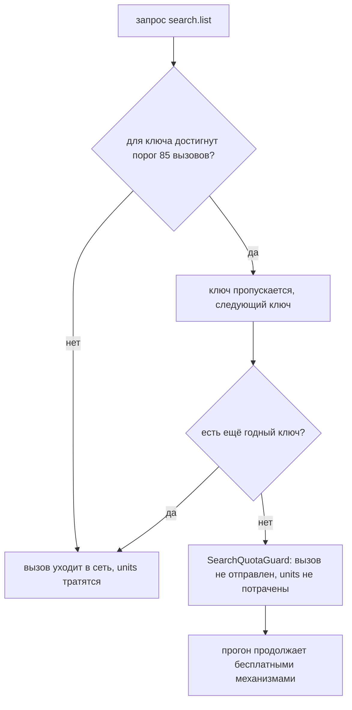

# Отчёт ТЗ-16. Квота YouTube по проектам (закрытие D-10) + экспорт внешних кандидатов

Дата: 15.09.2026. Планировщик `cac19aff0820` и `a87e848c076a` на паузе на время прогона.
Все прогоны с записью — на копиях БД в `/tmp`; рабочая `data/tuber.db` только читалась.

## 1. Что было → что стало

| Область | Было | Стало |
|---|---|---|
| Лимит вызовов поиска | нигде не учитывался; жёсткий лимит Google 100 `search.list`/сутки на проект не защищён | `QUOTA_SEARCH_LIMIT_PER_PROJECT = 100`, `QUOTA_SEARCH_RESERVE = 15`, порог 85 считается в `YouTubeClient.search_stop_threshold` |
| Счётчик поиска | — | перед `search.list` считается число попыток `endpoint='search'` за сутки квоты (PT): по проекту для ключа с проектом, по ключу без него |
| Поведение на пороге | — | вызов не уходит, units не тратятся, поднимается `SearchQuotaGuard` с текстом `search quota guard: проект <p>: 85/100 (лимит 100, резерв 15)`; прогон продолжается бесплатными механизмами |
| Итог прогона | — | `collect` → `search_guard`, `expand` → `search_guard_reason` + `search_guard_skipped` |
| Привязка ключей к проектам | не заполнена (0 ключей) | 2 ключа (`<key-id-1>`, `<key-id-2>`) → проект `<gcp-project-number>`; 4 ключа без привязки (проекты неизвестны) |
| Внешние кандидаты Telegram/X | в описаниях лежали, не выгружались | команда `candidates-export` (JSONL, dry-режим) |
| Импорт YouTube-каналов из фида | не было | команда `candidates-import` (`videos.list`, 1 unit, UPSERT `channel_candidates`) |
| Долг D-10 | открыт | закрыт (см. `docs/TECH-DEBT.md`) |

## 2. Замеры до/после по пяти показателям

| Показатель | До | После | Комментарий |
|---|---|---|---|
| units/сутки (YouTube) | **9 578** (сутки квоты 14.09, PT) | **9 578** (механизм учёта не меняет расход) | Полные сутки после правки ещё не прошли; предохранитель порогом 8 000 units/проект уже действовал, добавился явный порог поиска |
| поисков/сутки (`search.list`) | **81 вызов = 8 100 units** (85% расхода) | **81** (замер тот же); теперь жёстко ограничено 85/проект | Два ключа проекта `<gcp-project-number>` вместе делали 28 + 13 = 41 поиск |
| кандидатов Telegram | **3** (отслеживается в tuber-telegram) | **1096** уникальных каналов выгружено из описаний | рост ×365 |
| кандидатов X | **12** (отслеживается в tuber-x) | **1086** уникальных аккаунтов выгружено | рост ×90 |
| ключей с привязкой к проекту | **0** из 6 | **2** из 6 | `<key-id-1>`, `<key-id-2>` → `<gcp-project-number>`; остальные 4 — проекты надо взять в консоли Google Cloud |

## 3. Числа рабочей базы до/после (сбор не задет)

| Таблица | До | После |
|---|---|---|
| `videos` | 30 780 | 30 780 |
| `channels` | 7 090 | 7 090 |
| `snapshots` | 71 992 | 71 992 |
| `channel_candidates` | 2 152 | 2 152 |
| `quota_log` units / строк | 96 673 / 8 959 | 96 673 / 8 959 |

Вся запись приёмки шла на копиях: `/tmp/tz16/copy.db`, `/tmp/tz16/copy_collect.db`.

## 4. Часть A. Предохранитель поисковой квоты

Схема решения при вызове `search.list`:



Замеры боевой `quota_log` (только чтение): сутки квоты 14.09 (PT) — 9 578 units, из них поиск
8 100 units = 81 вызов. По ключам: `<key-id-1>` 28, `<key-id-4>` 26, `<key-id-3>` 14,
`<key-id-2>` 13. Два ключа одного проекта вместе — 41 поиск.

Приёмка предохранителя — на копии, подставленными строками `quota_log` (живая поисковая
квота не тратилась): 60 строк у одного ключа проекта + 25 у второго = 85 → поиск блокируется,
сетевых вызовов 0, событие `search quota guard: проект <gcp-project-number>: 85/100 (лимит 100, резерв 15)`.
Полный `collect` при всех ключах на пороге вернул `queries_done=0, units=0,
search_guard="search quota guard: ключ <key-id-3>: 85/100 (лимит 100, резерв 15)"`.

### Важное уточнение поведения

Предохранитель блокирует **проект**, а не весь клиент: если у одного проекта порог достигнут,
а у другого ключа (другого проекта) есть запас, поиск уходит через него — так же, как уже
устроена ротация по units. Событие поднимается, когда **все** годные ключи упираются в
поисковый порог; тогда прогон реально переходит на бесплатные механизмы. Это согласуется с
требованием «продолжает работу остальными механизмами» и не сжигает чужой проектный бюджет.

### Честная оговорка про две линии защиты

Поиск стоит 100 units, поэтому units-порог 8 000 на проект срабатывает примерно на 80-м
поиске — раньше 85-го по счётчику вызовов. Отдельный счётчик вызовов всё равно нужен: он
считает именно то, что ограничивает Google (число вызовов), не зависит от цены поиска и
страхует случай, когда units считаются по ключу, а вызовы должны считаться по проекту.
На 15.09.2026 у связанного проекта расход далеко ниже обоих порогов (41 поиск, ≈ 4 800 units
за сутки).

## 5. Часть B. Экспорт внешних кандидатов

Команда: `python -m tuber.cli candidates-export [--out ...] [--min-mentions N] [--limit N] [--dry]`.
Читает только `videos.description/title/tags`. Отсеивает служебные пути (`t.me/s/`, `/c/`,
`/joinchat/`, `+`-инвайты; `x.com/i|home|intent|share|search|hashtag|status|explore|settings|login|signup|messages|notifications|tos|privacy`),
нормализует (низкий регистр, без `@`), дедуп по `(kind, handle)`.

Живой прогон `candidates-export --dry` на рабочей БД (только чтение):

```
kind_counts = {"telegram": 1096, "x": 1086}
ai_hint_count = 1756
rows_total = 2182
top-10: ndtvbot(370), ndtv(370), skynews(259), khabar_gaon(249), rajshamani(229),
        testvtak_bot(182), vot_tak_exclusive(182), vottakvideo(182), vottak_tv(182), business(179)
```

Формат строки JSONL: `kind, handle, mentions, videos, first_seen, last_seen, ai_hint, source,
examples, exported_at`. Запись файла на копии: 2 182 строки, сортировка `mentions desc,
videos desc`. `--dry` файл не пишет. Каталог `data/exchange/` добавлен в `.gitignore`.

## 6. Часть C. Импорт YouTube-каналов из фида

Команда: `python -m tuber.cli candidates-import --feed <path> [--limit 50] [--dry]`.
Читает только строки `kind="youtube"` (поле `video_id`/`id` или ссылки `youtube.com/watch?v=`
и `youtu.be/<id>`). Резолв канала — `videos.list` (part=snippet), 1 unit за вызов; запись в
`channel_candidates` (`source="tg:tuber-telegram"`, `evidence="tg:<video_id>"`, `status='new'`),
повторная находка — `mentions+1` без дубля. Не больше `--limit` сетевых вызовов; при срабатывании
общего предохранителя квоты прогон останавливается и печатает итог.

Живой импорт на копии (`copy.db`): 2 YouTube-видео → `resolved=2, new=2, calls=2, units=4`,
`channel_candidates` 2152 → 2154; повторный импорт → `known=2, new=0`, mentions стали 2.
Отсутствующий/битый фид → JSON `{"error": ...}` и код 1 без трейсбека.

## 7. Таблица тестов с фактическим выводом

```
$ python -m pytest -q
458 passed in 14.59s
```

| Тест | Проверяет | Вывод |
|---|---|---|
| `test_quota_search.py::test_two_keys_one_project_share_search_counter` | (a) 60+25=85 на проект → блок | PASSED |
| `test_different_projects_are_independent` | (b) разные проекты независимы | PASSED |
| `test_key_without_project_is_counted_per_key` | (c) ключ без проекта — прежний режим | PASSED |
| `test_below_threshold_search_passes` | (d) ниже порога поиск проходит | PASSED |
| `test_threshold_is_exact_at_85` | порог включительный (84 — нет, 85 — да) | PASSED |
| `test_unbound_full_project_style_key_is_blocked` | событие с текстом для ключа без проекта | PASSED |
| `test_non_search_endpoint_ignores_search_guard` | `videos.list` не блокируется | PASSED |
| `test_expand_search_step_reports_guard_without_crash` | expand ловит событие, units=0 | PASSED |
| `test_collect_reports_guard_without_crash` | collect ловит событие, в итоге причина | PASSED |
| `test_candidates.py::test_export_writes_jsonl_with_all_fields` | поля и агрегаты JSONL | PASSED |
| `test_export_sorted_by_mentions_then_videos` | сортировка | PASSED |
| `test_export_dry_writes_nothing` | `--dry` не пишет файл | PASSED |
| `test_extract_mentions_accepts_valid_and_rejects_service_paths` | отсев служебных путей | PASSED |
| `test_read_youtube_feed_kinds_and_urls` | фильтр kind и формы ссылок | PASSED |
| `test_read_youtube_feed_missing_file` / `_broken_json` | понятная ошибка фида | PASSED |
| `test_import_resolves_channels_and_bumps_mentions` | UPSERT, mentions+1 | PASSED |
| `test_import_respects_limit` / `test_import_stops_on_quota_error` | пределы и остановка | PASSED |
| `test_import_dry_no_network_no_writes` | `--dry` без сети и записи | PASSED |
| `test_debt_registry.py` | номера долгов уникальны, маркеры без сирот | 2 PASSED |

## 8. Найденные проблемы и рекомендации

1. **Привязка неполная.** Проекты 4 ключей (`<key-id-3>`, `<key-id-4>`, `<key-id-5>`,
   `<key-id-6>`) неизвестны и не выдумывались. Рекомендация владельцу: взять ID проектов в
   консоли Google Cloud (страница ключей API) и дописать `project` в
   `/root/.hermes/data/yt_keys.json` — счётчики по проекту включатся сами, без правок кода.
   Особенно важно, если какие-то из этих ключей принадлежат одному проекту с уже связанными.
2. **Поисковый лимит и units перекрываются.** При проектном учёте units-порог 8 000 срабатывает
   раньше 85-го поиска. Это не ошибка, а эшелонированная защита; но если владелец захочет
   использовать поисковый бюджет до 100 вызовов, нужно снизить `COST_SEARCH`-давление или
   поднимать `QUOTA_SAFETY_RESERVE` осознанно (менять только осознанно, порог считается в
   одном месте).
3. **Столкновение с Oct-изменением цены поиска.** Если Google изменит цену `search.list`,
   отдельный счётчик вызовов останется верным, а units-порог — нет; это ещё один довод в
   пользу счётчика вызовов.
4. **Качество кандидатов X/Telegram.** В экспорте много медийных аккаунтов (ndtv, skynews) —
   это ожидаемо, в описаниях новостных видео стоят соцсети. Рекомендуется фильтровать по
   `ai_hint` и `mentions` при импорте в реестры (поле есть в каждой строке).
5. **ai_hint — эвристика без LLM.** Термины берутся из `config.TOPICS` + базовый список ИИ-слов;
   русские основы матчатся по префиксу (`нейросет` → `нейросети`), ASCII-сокращения — по
   границам слова. 1 756 из 2 182 кандидатов (80%) помечены `ai_hint=1`, что отражает
   ИИ-направленность базы.

## 9. Артефакты

- `docs/acceptance-log-16.txt` — журнал приёмки с фактическим выводом всех шагов.
- Копия экспорта (пример файла): `/tmp/tz16/external_candidates.jsonl` (2 182 строки).
- Изменённые файлы: `tuber/config.py`, `tuber/yt.py`, `tuber/collect.py`, `tuber/expand.py`,
  `tuber/cli.py`, `tuber/candidates.py` (новый), `tests/test_quota_search.py` (новый),
  `tests/test_candidates.py` (новый), `docs/TECH-DEBT.md`, `.gitignore`.
